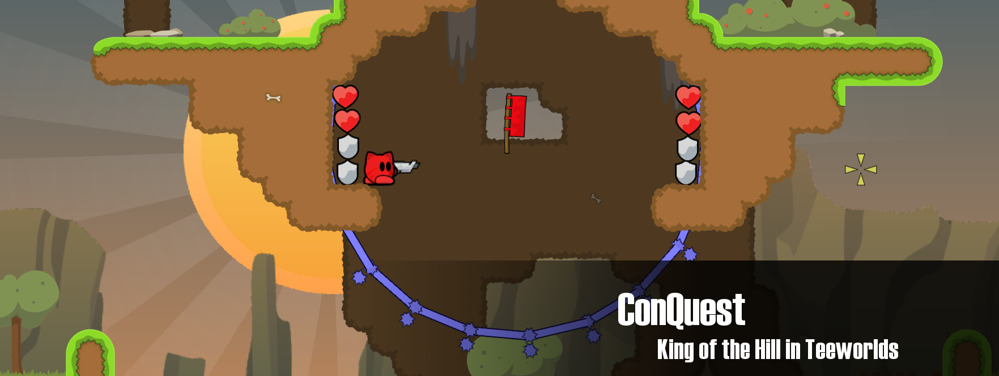

Teeworlds-Conquest
==============

A team based King of the Hill (Capture-the-Point) Server modification for the open source game Teeworlds.

Compiling
-------

To compile this follow the steps of the original [Compiling Everything](https://www.teeworlds.com/?page=docs&wiki=compiling_everything) tutorial on teeworlds.com. It should be noted that this mod requires a c++11 supported compiler.

Custom commands/tunes
------
There are currently 3 custom tunes and 0 custom commands. 

The tunes contain:
- capture_default_radius (default 250.0)
	- The radius of the default capture point entities.
- capture_speed_tick (default 0.3)
	- The speed that you capture the point with (stacks up to 3 times depending on the amount of tees standing on the point)
- capture_rotate (default 0.1)
	- The rotation speed of the capture point. Purely visual.

Mapping
------
The rule is simple. You place flag -> you placed capture point. Both flags do the exact same thing.
There are 5 custom flags with each having a different radius. They don't react on capture_default_radius, but instead have their own radius. The entities.png in datasrc/editor will help you surely. Also the new set radii tiles look like this 

